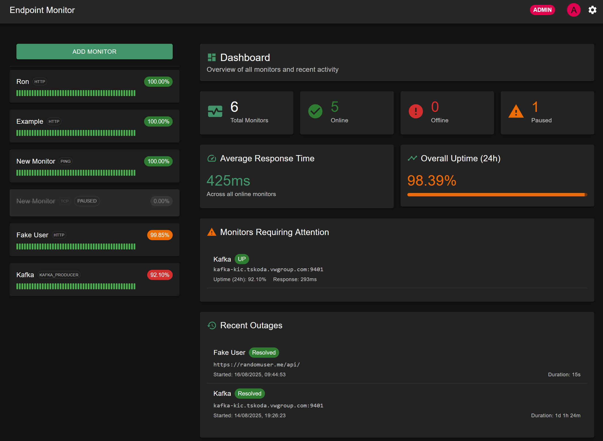
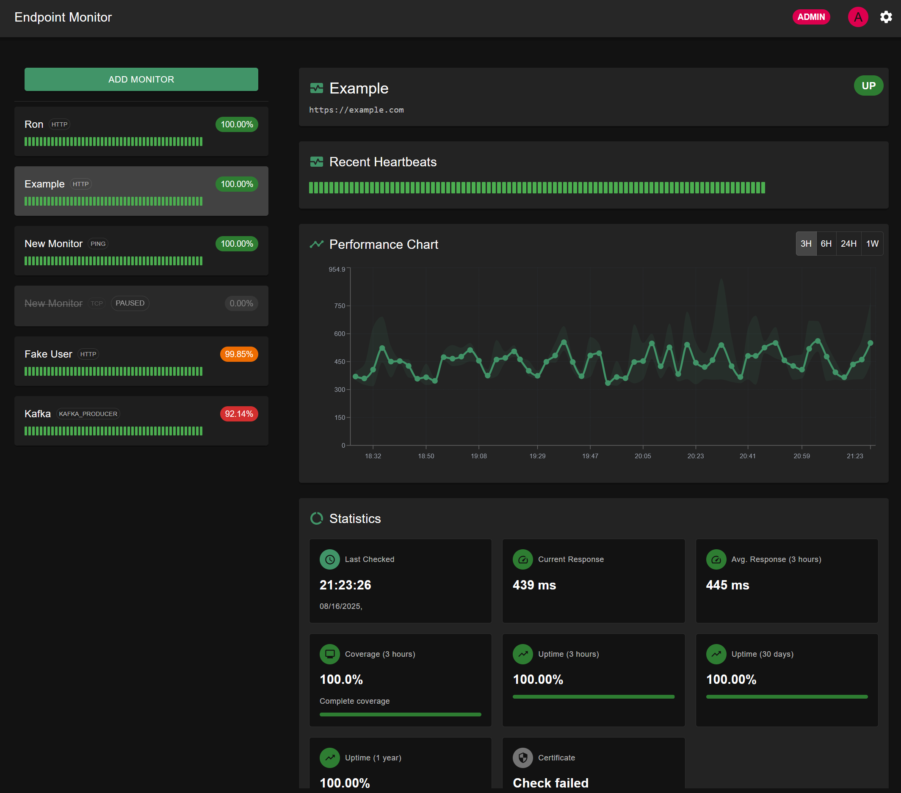

# Endpoint Monitor

A comprehensive endpoint monitoring application built with Bun, Elysia, React, and TypeScript. Monitor HTTP endpoints, ping hosts, TCP ports, and Kafka services with real-time alerts and detailed analytics.




## Features

- **Multi-Protocol Monitoring**: HTTP/HTTPS, Ping, TCP, Kafka (Producer/Consumer)
- **Authentication**: Local users + OIDC/OAuth2 support
- **Real-time Alerts**: Telegram, Email (SendGrid), Slack, Apprise
- **SSL Certificate Monitoring**: Track certificate expiration
- **mTLS Support**: Client certificate authentication
- **Status Pages**: Public status pages for your services
- **Advanced Analytics**: Gap-aware uptime calculations, response time tracking
- **User Management**: Role-based access control (Admin/User)

## Quick Start with Docker

### Prerequisites

- Docker and Docker Compose
- Git

### 1. Clone and Deploy

```bash
git clone <your-repo-url>
cd endpoint-monitor
cp .env.example .env
# Edit .env with your configuration
docker compose up -d
```

### 2. Access the Application

Open http://localhost:3001 in your browser.

**Default Admin Credentials:**
- Username: `admin`
- Password: `admin123` (or value from `DEFAULT_ADMIN_PASSWORD`)

⚠️ **Change the default password immediately after first login!**

## Environment Configuration

Copy `.env.example` to `.env` and configure:

```bash
# Database Configuration
DB_PATH=/app/data/db.sqlite

# Security Configuration (REQUIRED - Change these!)
JWT_SECRET=your-super-secret-jwt-key-min-32-characters
JWT_EXPIRES_IN=7d

# Default Admin User
DEFAULT_ADMIN_PASSWORD=secure-admin-password

# Application Configuration
NODE_ENV=production
PORT=3001

# Logging Configuration
LOG_LEVEL=info
```

### Important Security Notes

1. **Change JWT_SECRET**: Use a strong, random string (minimum 32 characters)
2. **Change DEFAULT_ADMIN_PASSWORD**: Use a secure password
3. **Use HTTPS**: Deploy behind a reverse proxy with SSL termination

## Docker Compose Configurations

### Production Deployment

```yaml
# docker-compose.yml
version: '3.8'

services:
  monitor:
    image: ghcr.io/your-username/endpoint-monitor:latest
    container_name: endpoint-monitor
    restart: unless-stopped
    ports:
      - "3001:3001"
    volumes:
      - monitor_data:/app/data
    env_file:
      - .env
    healthcheck:
      test: ["CMD", "bun", "--cwd", "backend", "-e", "fetch('http://localhost:3001/api/endpoints').then(r => r.ok ? process.exit(0) : process.exit(1)).catch(() => process.exit(1))"]
      interval: 30s
      timeout: 10s
      retries: 3
      start_period: 40s

volumes:
  monitor_data:
    driver: local
```

### Development Setup

```bash
# Use development compose file
docker compose -f docker-compose.dev.yml up -d
```

## Building Custom Images

### Build Locally

```bash
docker build -t endpoint-monitor:local .
```

### Multi-Architecture Build

```bash
docker buildx build --platform linux/amd64,linux/arm64 -t endpoint-monitor:multi .
```

## GitHub Container Registry Setup

This application automatically builds and publishes Docker images to GitHub Container Registry.

### Automatic Builds

Images are built automatically on:
- Push to `main` branch → `ghcr.io/your-username/endpoint-monitor:latest`
- Push to `develop` branch → `ghcr.io/your-username/endpoint-monitor:develop`
- Version tags (`v1.0.0`) → `ghcr.io/your-username/endpoint-monitor:1.0.0`

### Manual Usage

1. **Update docker-compose.yml** with your GitHub username:
   ```yaml
   image: ghcr.io/YOUR-USERNAME/endpoint-monitor:latest
   ```

2. **Deploy**:
   ```bash
   docker compose pull
   docker compose up -d
   ```

### Using Pre-built Images

To use images from GitHub Container Registry:

```bash
# Pull latest image
docker pull ghcr.io/your-username/endpoint-monitor:latest

# Run with docker-compose
docker compose up -d
```

## Production Deployment Guide

### 1. Reverse Proxy Setup (Nginx)

```nginx
server {
    listen 80;
    server_name monitor.yourdomain.com;
    return 301 https://$server_name$request_uri;
}

server {
    listen 443 ssl http2;
    server_name monitor.yourdomain.com;

    ssl_certificate /path/to/ssl/cert.pem;
    ssl_certificate_key /path/to/ssl/key.pem;

    location / {
        proxy_pass http://localhost:3001;
        proxy_set_header Host $host;
        proxy_set_header X-Real-IP $remote_addr;
        proxy_set_header X-Forwarded-For $proxy_add_x_forwarded_for;
        proxy_set_header X-Forwarded-Proto $scheme;
        
        # WebSocket support (if needed)
        proxy_http_version 1.1;
        proxy_set_header Upgrade $http_upgrade;
        proxy_set_header Connection "upgrade";
    }
}
```

### 2. Systemd Service (Alternative to Docker)

If you prefer running without Docker:

```ini
[Unit]
Description=Endpoint Monitor
After=network.target

[Service]
Type=simple
User=monitor
WorkingDirectory=/opt/endpoint-monitor
ExecStart=/usr/local/bin/bun start
Restart=always
RestartSec=5
Environment=NODE_ENV=production
Environment=DB_PATH=/opt/endpoint-monitor/data/db.sqlite
Environment=JWT_SECRET=your-secret-here
Environment=DEFAULT_ADMIN_PASSWORD=your-password-here

[Install]
WantedBy=multi-user.target
```

### 3. Database Backup Strategy

```bash
#!/bin/bash
# backup-script.sh
DATE=$(date +%Y%m%d_%H%M%S)
DB_PATH=/opt/endpoint-monitor/data/db.sqlite
BACKUP_DIR=/opt/backups/endpoint-monitor

mkdir -p $BACKUP_DIR
sqlite3 $DB_PATH ".backup $BACKUP_DIR/db_backup_$DATE.sqlite"

# Keep only last 30 days of backups
find $BACKUP_DIR -name "db_backup_*.sqlite" -mtime +30 -delete
```

Add to cron:
```bash
# Backup database daily at 2 AM
0 2 * * * /opt/scripts/backup-script.sh
```

## Development

### Local Development Setup

1. **Install Bun**:
   ```bash
   curl -fsSL https://bun.sh/install | bash
   ```

2. **Install Dependencies**:
   ```bash
   bun install
   cd frontend && bun install
   cd ../backend && bun install
   ```

3. **Start Development**:
   ```bash
   # Start application (builds frontend + runs backend)
   bun start

   # Or develop frontend separately
   cd frontend && bun run dev  # Frontend dev server
   cd backend && bun run dev   # Backend only
   ```

### Docker Development

```bash
# Build and run development environment
docker compose -f docker-compose.dev.yml up --build

# View logs
docker compose -f docker-compose.dev.yml logs -f

# Rebuild after changes
docker compose -f docker-compose.dev.yml up --build
```

## Configuration

### Monitoring Configuration

- **Heartbeat Intervals**: 30s to 3600s
- **Retry Attempts**: 1-10 retries before marking as DOWN
- **Timeout**: 10 seconds for HTTP/TCP, configurable for Kafka
- **SSL Certificate Monitoring**: 30-day default warning threshold

### Notification Services

Support for multiple notification channels:

- **Telegram**: Bot token + Chat ID
- **Email (SendGrid)**: API key + from/to emails
- **Slack**: Webhook URL
- **Apprise**: Multiple service URLs

### OIDC/OAuth2 Integration

Configure external authentication providers:

- Google Workspace
- Microsoft Azure AD
- Keycloak
- Any OIDC-compliant provider

## API Documentation

The application provides REST APIs for monitoring and management:

- `GET /api/endpoints` - List all endpoints
- `POST /api/endpoints` - Create new endpoint
- `GET /api/endpoints/:id/stats` - Get endpoint statistics
- `GET /api/status-pages/public/:slug` - Public status page data

## Troubleshooting

### Common Issues

1. **Database Locked Error**:
   ```bash
   # Stop container, backup DB, restart
   docker compose down
   # Check if DB file is corrupted
   docker compose up -d
   ```

2. **Permission Issues**:
   ```bash
   # Fix data directory permissions
   sudo chown -R 1000:1000 /path/to/monitor/data
   ```

3. **Memory Issues**:
   ```yaml
   # Add memory limits to docker-compose.yml
   deploy:
     resources:
       limits:
         memory: 512M
   ```

### Logs

```bash
# View application logs
docker compose logs -f monitor

# View specific component logs
docker exec -it endpoint-monitor bun --cwd backend -e "console.log('Health check')"
```

## License

[Your License Here]

## Support

- **Issues**: GitHub Issues
- **Documentation**: This README
- **Community**: [Your community links]

## Contributing

1. Fork the repository
2. Create a feature branch
3. Make your changes
4. Submit a pull request

---

**Security Notice**: This application handles sensitive monitoring data. Always:
- Use strong passwords and JWT secrets
- Deploy behind HTTPS
- Regularly update dependencies
- Monitor access logs
- Keep backups of your database
